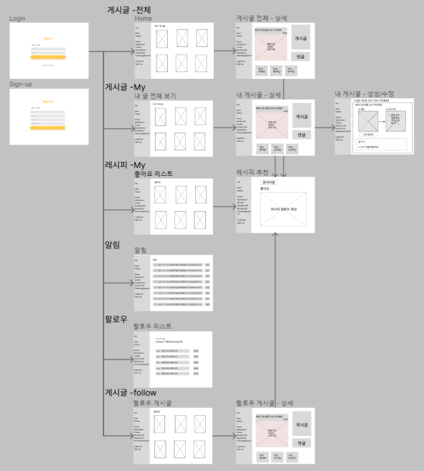
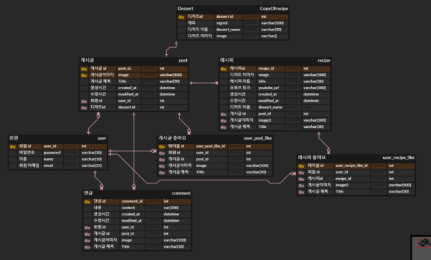

### 내일배움캠프 2번째 프로젝트
# 사물인식 프로젝트
## 트러블 슈팅 내용 & 기능 & 현황판
https://bolder-starburst-a73.notion.site/dccb55d23e7843c69d1f84122270a1d7
## ****프로젝트 핵심 목적****
- 사물인식 머신러닝 기능을 적용하여 사용자에게 음식 레시피를 추천하는 서비스 페이지를 구현
머신러닝 모델은 Roboflow의 과일 데이터셋을 활용하여 학습시켰으며,Object Detecting 기능은 Yolov5 라이브러리를 깃헙에서 로드하여 학습된 모델을 활용해 인식하도록 한다.
-  DJANGO의 CRUD 기능을 활용하여 사용자가 자신의 음식 사진과 레시피를 게시하고, 다른 유저들과 공유할 수 있는 플랫폼 제공한다. 게시글은 댓글, 좋아요 기능이 있어 사용자 간 커뮤니케이션을 원활히 할 수 있도록 한다.
# ⚙ 개발환경
## back-end :  

## front-end :    

## ****🕸 와이어 프레임****

## ****🎯 데이터베이스****

## ****🎨 API 설계****

